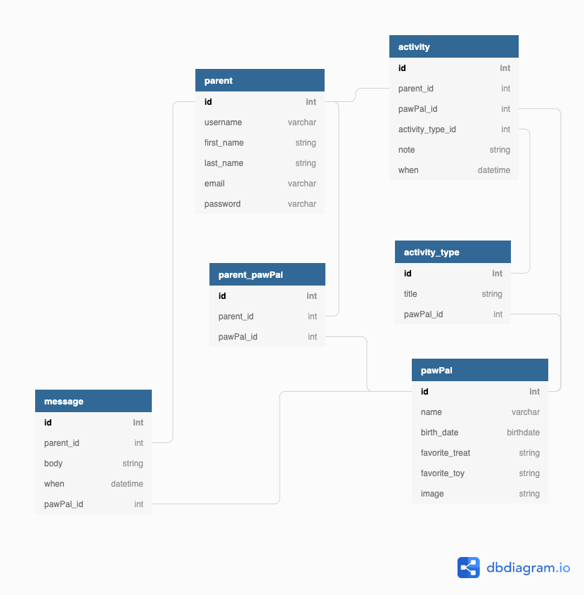

# PawPal

A Django Web Application built by [Kirk Sudduth](https://kirksudduth.github.io/KirkSudduth/ "Check out my personal site :P") for [Nashville Software School: Cohort 40](https://nss-cohort-40.github.io/#)

## Proposal

It can be a task to remember what you've done 5 minutes ago some days. PawPal allows pet owners the affordance of not having to worry whether or not they need to perform any pet-related tasks. Your days are busy enough -- let PawPal help carry the load!

## Project Definition

- Built with _Django_ and _Bootstrap_
- Users can create account and login with _Django_ authentication
- Users can create a new PawPal, a new Activity Type, a new time stamped Activity and a new Message (to PawPal's message board)
- Users can update their email and username as well as any note on an Activity they had created previously
- Users can delete an Activity
- Users can keep up with everything they do for and with their PawPal!

## Setup

> macOS and Linux (Python and Pip need to be installed)

1. `git clone https://github.com/kirksudduth/PawPal.git` in the directory you want the project in your terminal
1. run these commands:
   > `cd PawPal/pawpalproject` > `python3 -m venv pawpalEnv` > `source ./pawpalEnv/bin/activate` > `pip install -r requirements.txt` > `python manage.py makemigrations pawpalapp` > `python manage.py migrate`
1. open the project in your favorite code editor (_VSCode_... right??)
1. open the _Extensions: Marketplace_ and download the **SQLTools** extension (_Matheus Teixeira_)
1. then download the **SQLite** extension (_alexcvzz_)
1. click on the **SQLTools** icon on the left side of your _VSCode_ window
1. click the **add new connection** button
1. click the **SQLite (Node)** driver affordance
1. in the _Connection name\*_ field write `pawpal`
1. in the _Database file_ field write `db.sqlite3`
1. click **TEST CONNECTION** -- if _successful_: **SAVE CONNECTION** then click **CONNECT NOW**
   else: _Google_
1. then load fixtures:
   - `python manage.py loaddata users`
   - `python manage.py loaddata paw_pals`
   - `python manage.py loaddata parents_pawpals`
   - `python manage.py loaddata activity_types`
   - `python manage.py loaddata activities`
   - `python manage.py loaddata messages`
1. login with
   > username: _anne_
   > password: _pawpalpass123_
   - or register a new user
1. explore the functionality of **PawPal**!

## Overview

**Do not login with any sensitive information. This is not a secure application.**

This app is for users who don't want to ask themselves or their loved ones:

- "Did I/you feed \_**\_** ?"
- "Does \_**\_** need to be let out?"

- "Has \_**\_** been given their medicine today?"

Now users can know, to the minute, the time when an activity was last completed. Save time and win those arguments about who's _really_ taking care of your PawPal.

## Technologies Used

- This project was built with [Django Web Framework](https://www.djangoproject.com/)
- [Python](https://www.python.org/)
- [Bootstrap4](https://getbootstrap.com/docs/4.5/getting-started/introduction/) for buttons, layout and navbar
- [Coolors](https://coolors.co/) for picking color scheme

## Skills Utilized

I made practical use of all the skills I have learned at NSS up to this point, including:

1. Django ORM
1. Django registration authentication
1. Class Based Form Rendering
1. Many to many relationships
1. Incorporating Bootstrap into application

## Database Diagram

